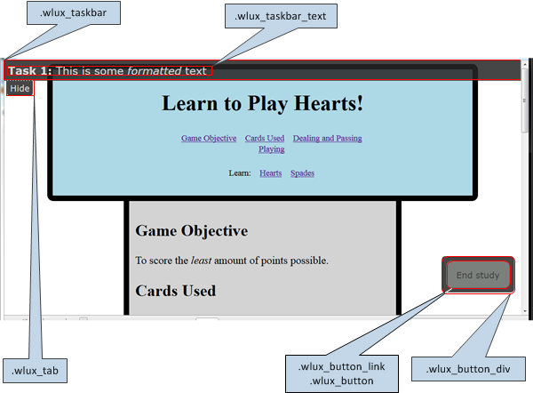

# Task bar
------

The task bar is an optional window that can be displayed on the website pages being studied. The appearance of the task bar can be customized by modifying the CSS styles shown in the illustration. The default styles are stored in [wluxTaskBar.css](.\wluxTaskBar.css). 

## Styles used by the taskBarCSS file
The taskBarCSS file referenced in the study config data object uses the styles shown here to configure the task bar and  task/study end button.

